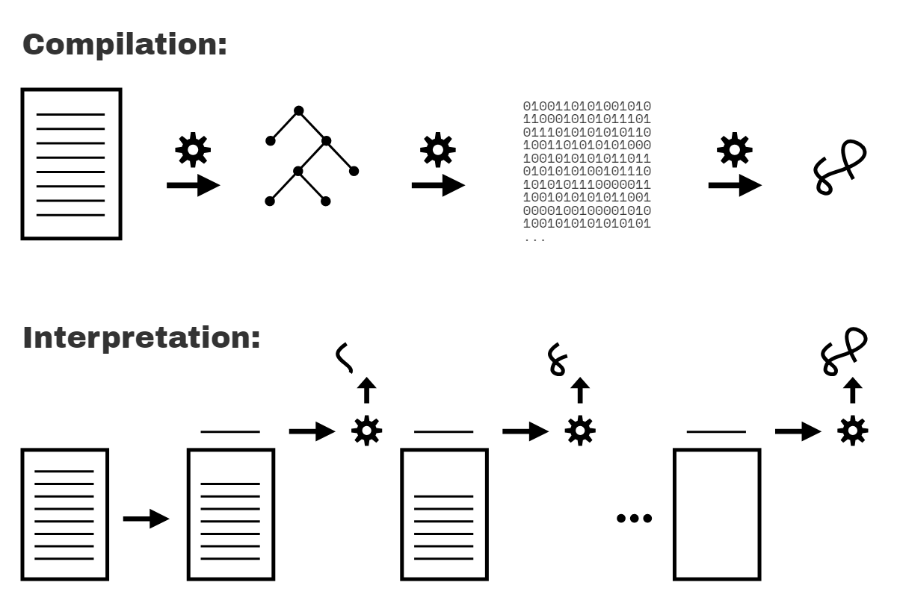

# You Don't Know JS Yet: Scope & Closures - 2nd Edition
# Chapter 1: What's the Scope?

JS knows which variables are accessible by any given statement through well-defined rules called **scope**. Understanding scope requires understanding how the JS engine processes a program **before** it runs.

## Compiled vs. Interpreted

- **Compilation:** the entire source code is transformed at once into instructions, saved as output, executed later.
- **Interpretation:** source code is transformed and executed line by line — each line runs before the next is processed.

<figure>
    
    <figcaption><em>Fig. 1: Compiled vs. Interpreted Code</em></figcaption>
    <br><br>
</figure>

These models are not strictly mutually exclusive. Modern JS engines use variations of both. JS is most accurately classified as a **compiled language**.

## Compiling Code

Scope is primarily determined during compilation. In classic compiler theory, a program is processed in three stages:

1. **Tokenizing/Lexing:** breaking a string of characters into meaningful chunks called tokens. For `var a = 2;`, tokens are: `var`, `a`, `=`, `2`, `;`.

    (Tokenizing vs. lexing: if the tokenizer invokes stateful parsing rules to determine whether `a` is a distinct token or part of another token, that is **lexing**.)

2. **Parsing:** taking a stream of tokens and turning it into a tree of nested elements representing the grammatical structure — an **Abstract Syntax Tree (AST)**.

    For `var a = 2;`, the AST starts with a `VariableDeclaration` node, with a child `Identifier` (value `a`), and a child `AssignmentExpression` with a child `NumericLiteral` (value `2`).

3. **Code Generation:** taking an AST and turning it into executable code. For `var a = 2;`, this produces machine instructions to create a variable `a` (reserve memory, etc.) and store the value.

The JS engine is more complex than these three stages — parsing and code generation include optimization steps, and code can be re-compiled and re-optimized during execution.

JS compilation happens in microseconds or less right before execution (no ahead-of-time build step). JS engines use JITs (lazy compile, hot re-compile) to meet this constraint.

### Required: Two Phases

JS programs are processed in (at least) two phases: **parsing/compilation first, then execution**. This is observable fact, not theory — three program characteristics demonstrate it:

#### Syntax Errors from the Start

```js
var greeting = "Hello";

console.log(greeting);

greeting = ."Hi";
// SyntaxError: unexpected token .
```

`"Hello"` is never printed. The JS engine detects the syntax error on line 4 before executing lines 1–2. This is only possible if the entire program is parsed before any of it executes.

#### Early Errors

```js
console.log("Howdy");

saySomething("Hello","Hi");
// Uncaught SyntaxError: Duplicate parameter name not
// allowed in this context

function saySomething(greeting,greeting) {
    "use strict";
    console.log(greeting);
}
```

`"Howdy"` is never printed. Strict-mode forbids duplicate parameter names. The engine detects this error before execution — including knowing the function is in strict-mode from the pragma in its body — because the code is fully parsed first.

#### Hoisting

```js
function saySomething() {
    var greeting = "Hello";
    {
        greeting = "Howdy";  // error comes from here
        let greeting = "Hi";
        console.log(greeting);
    }
}

saySomething();
// ReferenceError: Cannot access 'greeting' before
// initialization
```

The `greeting = "Howdy"` statement belongs to the `let greeting = "Hi"` declaration on the next line (not to `var greeting = "Hello"`). The engine can only know this at the error-throw line by having already processed the code in an earlier pass — setting up all scopes and variable associations before execution.

The `ReferenceError` results from accessing `greeting` in the **Temporal Dead Zone (TDZ)**.

| WARNING: |
| :--- |
| It's often asserted that `let` and `const` declarations are not hoisted, as an explanation of the TDZ behavior just illustrated. But this is not accurate. Both the hoisting and TDZ of `let`/`const` are covered in Chapter 5. |

## Compiler Speak

During compilation, the JS engine identifies variables and determines scopes. Consider this program:

```js
var students = [
    { id: 14, name: "Kyle" },
    { id: 73, name: "Suzy" },
    { id: 112, name: "Frank" },
    { id: 6, name: "Sarah" }
];

function getStudentName(studentID) {
    for (let student of students) {
        if (student.id == studentID) {
            return student.name;
        }
    }
}

var nextStudent = getStudentName(73);

console.log(nextStudent);
// Suzy
```

Other than declarations, all variable/identifier occurrences serve in one of two roles: either they're the **target** of an assignment or they're the **source** of a value. (Formerly called LHS/RHS — "Left-Hand Side" / "Right-Hand Side" of `=` — but *target*/*source* is more accurate, since assignment targets and sources don't always appear on the left or right of `=`.)

**A variable is a target if a value is being assigned to it. Otherwise it is a source.**

### Targets

Five *target* references in the program above:

```js
students = [ // ..
```
Direct assignment (`var students` is handled at compile time; irrelevant at runtime).

```js
nextStudent = getStudentName(73)
```
Direct assignment.

```js
for (let student of students) {
```
`student` is assigned a value on each loop iteration.

```js
getStudentName(73)
```
The argument `73` is assigned to the parameter `studentID`.

```js
function getStudentName(studentID) {
```
A `function` declaration is a special *target* reference. The identifier `getStudentName` is declared at compile time, and the association between `getStudentName` and the function is set up automatically at the beginning of the scope (not at an `=` assignment statement).

| NOTE: |
| :--- |
| This automatic association of function and variable is referred to as "function hoisting", and is covered in detail in Chapter 5. |

### Sources

All remaining variable references are *source* references.

In `for (let student of students)`: `student` is a target, `students` is a source.

In `if (student.id == studentID)`: both `student` and `studentID` are sources.

In `return student.name`: `student` is a source.

In `getStudentName(73)`: `getStudentName` is a source.

In `console.log(nextStudent)`: `console` and `nextStudent` are sources.

| NOTE: |
| :--- |
| `id`, `name`, and `log` are all properties, not variable references. |

## Cheating: Runtime Scope Modifications

Scope is determined at compile time and is generally not affected by runtime conditions. In non-strict-mode, two mechanisms can modify scope at runtime — both are dangerous and should never be used. Strict-mode disallows both.

**`eval(..)`** compiles and executes a string of code at runtime. `var` or `function` declarations inside that string modify the current scope:

```js
function badIdea() {
    eval("var oops = 'Ugh!';");
    console.log(oops);
}
badIdea();   // Ugh!
```

Without `eval(..)`, `oops` would not exist and `console.log(oops)` would throw a `ReferenceError`. `eval(..)` modifies the already-compiled, already-optimized scope on every call — a performance hit.

**`with`** dynamically turns an object into a local scope — its properties become identifiers in a new scope block:

```js
var badIdea = { oops: "Ugh!" };

with (badIdea) {
    console.log(oops);   // Ugh!
}
```

`badIdea` becomes a scope at runtime (not compile time), and its property `oops` becomes a variable in that scope. Both `eval(..)` and `with` are disallowed in strict-mode.

## Lexical Scope

JS scope is determined at compile time — this is called **lexical scope** (associated with the "lexing" stage of compilation).

Key rules:

- Lexical scope is controlled entirely by the **placement** of functions, blocks, and variable declarations relative to one another.
- A variable declared inside a function is associated with that function's scope.
- A block-scope declaration (`let` / `const`) is associated with the nearest enclosing `{ .. }` block, not the enclosing function (as with `var`).
- A variable reference (*target* or *source*) must resolve to a scope lexically available to it. If the variable is not declared in the current scope, the next outer/enclosing scope is consulted. This lookup walks outward one scope at a time until a matching declaration is found or the global scope is reached.
- An unresolved variable is "undeclared" — usually results in an error.

**Compilation does not reserve memory for scopes and variables.** Instead, it creates a map of all lexical scopes — a plan that defines all scopes (lexical environments) and registers all identifiers for each scope.

Scopes are identified during compilation but are **not created until runtime**, each time a scope needs to run.
